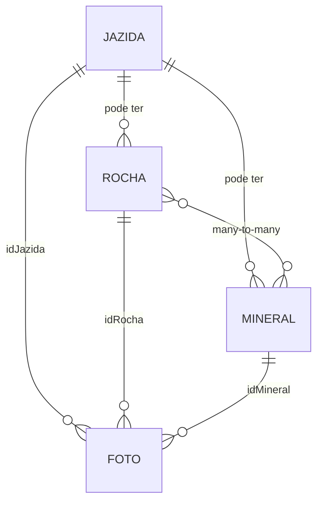

# Gerenciamento de rochas, minerais e jazidas

Este guia explica como cadastrar, editar, associar e publicar **jazidas**, **minerais** e **rochas** no **Museu Virtual**. O conteúdo é voltado a quem opera o painel administrativo (curadores, professores ou administradores), sem exigir conhecimento de programação.

---

## Visão geral

O Museu Virtual organiza o acervo geológico em três entidades principais:

| Entidade | O que representa | Identificação no painel |
|----------|------------------|-------------------------|
| **Jazida** | Local geográfico onde amostras podem ser encontradas | Campo **Localização** (ex.: “Serra do Curral — MG”) |
| **Mineral** | Substância mineral com propriedades físicas/químicas | Campo **Nome** (ex.: “Quartzo”) |
| **Rocha** | Agregado de minerais, classificado por origem | Campo **Nome** + **Tipo** (ígnea, metamórfica ou sedimentar) |

Além disso, cada item pode ter **fotos** (com uma imagem de **capa**) e aparecer no **site público** em páginas dedicadas.

### Como as entidades se relacionam

- Uma **jazida** pode estar ligada a várias **rochas** e **minerais** (opcional em ambos os lados).
- Uma **rocha** e um **mineral** podem estar associados entre si (relação N:N na tabela `rocha_minerals`).
- **Fotos** pertencem a exatamente um tipo de entidade por vez (rocha, mineral ou jazida).

### Ordem recomendada de cadastro

Para evitar formulários vazios nos seletores:

1. **Jazidas** — criar os locais primeiro.
2. **Minerais** — cadastrar substâncias e, se quiser, já vincular jazida e rochas existentes.
3. **Rochas** — cadastrar tipos de rocha, associar jazida e minerais.
4. **Fotos** (opcional) — complementar ou corrigir imagens pelo menu **Fotos**.

---

## Acesso ao painel

1. Acesse a URL do projeto (ex.: `https://seu-dominio.com/login`).
2. Faça login com usuário e senha cadastrados (Laravel Breeze).
3. Após o login, você será direcionado ao **Dashboard** (`/dashboard`).

O menu superior do painel contém:

| Menu | Rota | Função |
|------|------|--------|
| Home | `/dashboard` | Resumo, busca rápida de rochas e atalhos |
| Rochas | `/rochas` | Listar, criar, editar e excluir rochas |
| Jazidas | `/jazidas` | Listar, criar, editar e excluir jazidas |
| Minerais | `/minerais` | Listar, criar, editar e excluir minerais |
| Fotos | `/fotos` | Gerenciar imagens e anotações |
| Timeline | `/timeline` | Linha do tempo (fora do escopo deste guia) |

> **Nota:** As rotas de **jazidas** exigem usuário autenticado e e-mail verificado. Use sempre o painel logado para alterar o acervo.

---

## Gerenciamento de jazidas

### Listar jazidas

- Acesse **Jazidas** no menu ou `/jazidas`.
- A tabela mostra miniatura da primeira foto, **localização** e ações **Editar** / **Excluir**.
- Em dispositivos móveis, os cards exibem também a descrição resumida.

### Cadastrar uma jazida

1. Clique em **Cadastrar Jazida** ou acesse `/jazidas/create`.
2. Preencha os campos:

| Campo | Obrigatório | Descrição |
|-------|-------------|-----------|
| **Localização** | Sim | Nome ou referência do local (vira parte do `slug` da URL pública) |
| **Descrição** | Não | Texto rico (editor TinyMCE): história, contexto geológico, acesso ao local |
| **Fotos da jazida** | Não | Uma ou mais imagens (JPEG/PNG/JPG, até 2 MB cada) |

3. **Definir foto de capa:** após selecionar os arquivos, clique na miniatura desejada. Aparecerá a etiqueta **Capa**.
4. Clique em **Criar Jazida**.

As imagens são salvas em `storage/app/public/fotos/jazidas/` e servidas via `/storage/...`.

### Editar uma jazida

1. Na listagem, clique em **Editar** (`/jazidas/{id}/edit`).
2. Altere **Localização** e/ou **Descrição**.
3. Salve com o botão de envio do formulário.

A tela de edição atual permite atualizar texto; novas fotos na edição seguem a mesma lógica do cadastro quando o formulário incluir upload (conforme implementação da tela).

### Excluir uma jazida

1. Na listagem, clique em **Excluir**.
2. Confirme no alerta (SweetAlert).

A exclusão remove também as **fotos** vinculadas à jazida. Rochas e minerais que apontavam para essa jazida podem ficar sem vínculo (`jazida_id` nulo), conforme regra do banco.

### Onde a jazida aparece no site público

| Página | URL |
|--------|-----|
| Lista de jazidas | `/site/jazidas` |
| Detalhe de uma jazida | `/site/jazidas/{id}` |

---

## Gerenciamento de minerais

### Listar minerais

- Acesse **Minerais** ou `/minerais`.
- A listagem mostra foto de capa (ou primeira foto), **nome** e ações.

### Cadastrar um mineral

1. Acesse `/minerais/create` ou **Cadastrar Mineral** no dashboard.
2. Preencha:

| Campo | Obrigatório | Descrição |
|-------|-------------|-----------|
| **Nome** | Sim | Nome do mineral |
| **Descrição** | Sim* | Texto rico (TinyMCE) |
| **Propriedades** | Sim* | Características (dureza, brilho, clivagem, cor, etc.) |
| **Associar à jazida** | Não | Ative o interruptor **Sim** e escolha a jazida no select |
| **Associar a rochas** | Não | Marque uma ou mais rochas na lista (use a busca para filtrar por nome) |
| **Fotos do mineral** | Não | Múltiplos arquivos; clique em uma miniatura para definir **Capa** |

\* O formulário exige preenchimento no front-end; campos de texto podem ser validados no servidor na edição.

3. Clique em **Criar Mineral**.

O sistema gera automaticamente um **slug** a partir do nome (usado na URL pública).

**Associação com rochas:** os IDs marcados são gravados na tabela pivô `rocha_minerals`. A mesma associação pode ser feita ao editar uma **rocha** (visão inversa).

### Editar um mineral

1. Na listagem, **Editar** → `/minerais/{id}/edit`.
2. Atualize nome, descrição, propriedades, jazida e rochas associadas.
3. Salve; você retorna à listagem com mensagem de sucesso.

### Excluir um mineral

Confirme em **Excluir** na listagem. As fotos do mineral são removidas junto.

### Onde o mineral aparece no site público

| Página | URL |
|--------|-----|
| Lista de minerais | `/site/minerais` |
| Página do mineral | `/site/minerais/{slug}` |

Exemplo: mineral “Quartzo” → `/site/minerais/quartzo`.

---

## Gerenciamento de rochas

### Tipos de rocha

No cadastro, o campo **Tipo de Rocha** usa valores numéricos internos:

| Valor | Classificação | Exibição pública (agrupamento) |
|-------|---------------|--------------------------------|
| `1` | Ígneas | `/site/rochas` (bloco ígneas) e `/site/rochas/tipo/1` |
| `2` | Metamórficas | Idem, tipo `2` |
| `3` | Sedimentares | Idem, tipo `3` |

> No formulário de criação, a ordem das opções no select é: Ígneas, Metamórficas, Sedimentares (valores 1, 2 e 3 respectivamente).

### Rochas ornamentais

O interruptor **É uma rocha ornamental?** define o campo `ornamental`:

- **Sim** → a rocha entra na página pública **Rochas ornamentais** (`/site/rochasOrnamentais`).
- **Não** → aparece apenas nas listagens por tipo geológico.

### Listar e buscar rochas

- Acesse `/rochas`.
- Use o campo de busca no dashboard ou na listagem (parâmetro `?nome=...`) para filtrar por nome.
- Paginação: 10 itens por página no painel.

### Cadastrar uma rocha

1. Acesse `/rochas/create`.
2. Preencha:

| Campo | Obrigatório | Descrição |
|-------|-------------|-----------|
| **Nome** | Sim | Nome da rocha |
| **Descrição** | Sim | Texto rico (TinyMCE) |
| **Composição** | Sim | Minerais ou elementos principais |
| **Tipo de Rocha** | Sim | Ígnea, metamórfica ou sedimentar |
| **Rocha ornamental** | Sim | Sim/Não (interruptor) |
| **Associar à jazida** | Não | Interruptor + select de jazida |
| **Associar a minerais** | Não | Checkboxes com busca por nome |
| **Fotos da rocha** | Não | Múltiplas; uma deve ser marcada como **Capa** |

3. Clique em **Criar Rocha**.

O **slug** é gerado automaticamente a partir do nome e usado na URL pública da rocha.

### Editar uma rocha

1. **Editar** na listagem → `/rochas/{id}/edit`.
2. Altere os campos desejados; as associações com minerais são **sincronizadas** (substituem a lista anterior).
3. Salve.

### Excluir uma rocha

Confirme em **Excluir**. Fotos vinculadas são apagadas; vínculos com minerais na tabela pivô são removidos em cascata.

### Onde a rocha aparece no site público

| Página | URL |
|--------|-----|
| Rochas por tipo (visão geral) | `/site/rochas` |
| Rochas de um tipo | `/site/rochas/tipo/{1\|2\|3}` |
| Detalhe da rocha | `/site/rochas/{tipo}/{slug}` |
| Rochas ornamentais | `/site/rochasOrnamentais` |

---

## Fotos (complemento ao cadastro)

Além do upload nos formulários de jazida, mineral e rocha, o menu **Fotos** (`/fotos`) permite:

- Cadastrar imagens avulsas e ligá-las a uma rocha, mineral ou jazida.
- Filtrar fotos **sem ligação** (o dashboard alerta quando existem fotos órfãs).
- Editar caminho, vínculo e **anotações** sobre a imagem.

**Pastas de armazenamento:**

| Entidade | Pasta (disco `public`) |
|----------|-------------------------|
| Jazida | `fotos/jazidas/` |
| Rocha | `fotos/rochas/` |
| Mineral | `fotos/minerais/` |
| Geral | `fotos/geral/` |

**Capa:** em listagens públicas e no painel, prioriza-se a foto com flag `capa = 1`; se não houver, usa-se a primeira foto do registro.

---

## QR Code

Para material impresso ou exposição física, o sistema gera QR codes que apontam para páginas do acervo:

| Entidade | URL de geração (download PNG) |
|----------|-------------------------------|
| Jazida | `/jazidas/{id}/qrcode` |
| Rocha | `/rochas/{id}/qrcode` |
| Mineral | `/minerais/{id}/qrcode` |

Abra o link no navegador (logado, se necessário) para baixar a imagem PNG (300×300 px).

---

## Referência rápida de rotas (painel)

| Ação | Método | Rota nomeada |
|------|--------|--------------|
| Listar jazidas | GET | `jazidas.index` → `/jazidas` |
| Criar jazida | GET/POST | `jazidas.create` / `jazidas.store` |
| Editar jazida | GET/PUT | `jazidas.edit` / `jazidas.update` |
| Excluir jazida | DELETE | `jazidas.destroy` |
| Listar rochas | GET | `rochas.index` → `/rochas` |
| Criar rocha | GET/POST | `rochas.create` / `rochas.store` |
| Editar rocha | GET/PUT | `rochas.edit` / `rochas.update` |
| Excluir rocha | DELETE | `rochas.destroy` |
| Listar minerais | GET | `minerais.index` → `/minerais` |
| Criar mineral | GET/POST | `minerais.create` / `minerais.store` |
| Editar mineral | GET/PUT | `minerais.edit` / `minerais.update` |
| Excluir mineral | DELETE | `minerais.destroy` |

API auxiliar (selects externos): `GET /api/jazidas` retorna `{ id, localizacao }`.

---

## Fluxos de trabalho comuns

### Nova amostra completa (jazida + mineral + rocha)

1. Cadastre a **jazida** com fotos do local.
2. Cadastre o **mineral** associando a jazida e, se já existir, a rocha.
3. Cadastre a **rocha** com composição, tipo, flag ornamental se aplicável, jazida e minerais marcados.
4. Revise no site público as três URLs de detalhe.

### Só atualizar texto ou associações

- Use **Editar** na entidade correspondente; não é obrigatório reenviar fotos.
- Para trocar minerais de uma rocha, edite a rocha e marque/desmarque os checkboxes — o sistema faz `sync` da lista.

### Corrigir imagem de capa

- **Opção A:** no cadastro/edição da entidade, envie novas fotos e defina a capa pelas miniaturas.
- **Opção B:** em **Fotos**, edite o registro e ajuste o campo de capa (conforme tela de edição de fotos).

---

## Dicas e solução de problemas

| Problema | Causa provável | O que fazer |
|----------|----------------|-------------|
| Imagens não aparecem no site | Link simbólico do storage | No servidor: `php artisan storage:link` |
| Select de jazida vazio ao cadastrar rocha/mineral | Nenhuma jazida cadastrada | Cadastre jazidas primeiro |
| Mineral não aparece na ficha da rocha | Associação não feita | Edite rocha ou mineral e marque o vínculo nos checkboxes |
| URL pública da rocha retorna 404 | Slug alterado ou tipo incorreto na URL | Use `/site/rochas/{tipo}/{slug}` com o tipo numérico correto |
| Upload falha | Arquivo > 2 MB ou formato inválido | Use JPEG/PNG/JPG e reduza o tamanho |
| Dashboard alerta “fotos sem ligação” | Fotos em `/fotos` sem `idRocha` / `idMineral` / `idJazida` | Abra **Fotos** e associe ou exclua |

### Boas práticas de conteúdo

- Use **nomes consistentes** (ex.: “Granito Itaúna” em vez de abreviações internas).
- Preencha **descrição** e **composição/propriedades** com linguagem acessível ao público do museu.
- Sempre defina uma **foto de capa** de boa qualidade e enquadramento.
- Para rochas de exposição comercial ou decorativa, marque **ornamental** para facilitar a busca no site.

---

## Modelo de dados (referência técnica)

Resumo dos campos principais no banco:

**`jazidas`:** `localizacao`, `descricao`, `slug`

**`minerals`:** `nome`, `descricao`, `propriedades`, `jazida_id`, `slug`

**`rochas`:** `nome`, `descricao`, `composicao`, `tipo` (1/2/3), `jazida_id`, `ornamental`, `slug`

**`rocha_minerals`:** `rocha_id`, `mineral_id` (associação N:N)

**`fotos`:** `caminho`, `capa`, e um entre `idRocha`, `idMineral`, `idJazida`

---

## Documentação relacionada

- [Deploy em produção (Nginx)](./DEPLOY-PRODUCAO-NGINX.md) — publicação do site e configuração de `storage` e assets.

Para dúvidas sobre permissões de administrador (papéis Spatie), consulte o responsável técnico do projeto; rotas administrativas adicionais podem estar restritas ao papel `admin`.
